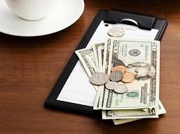
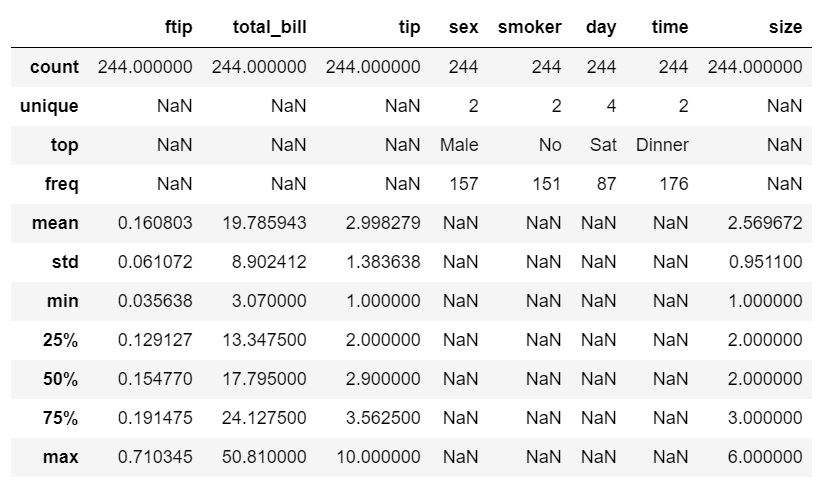
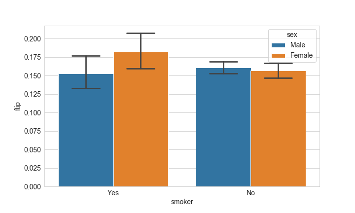
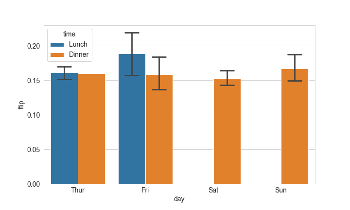
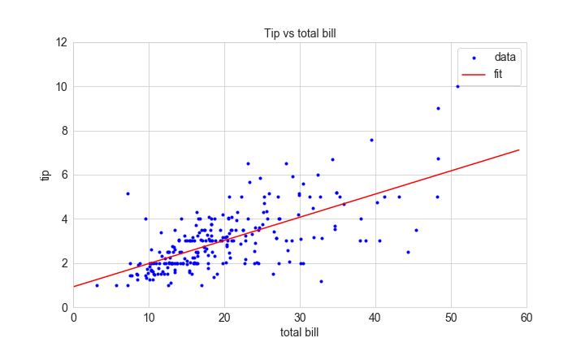
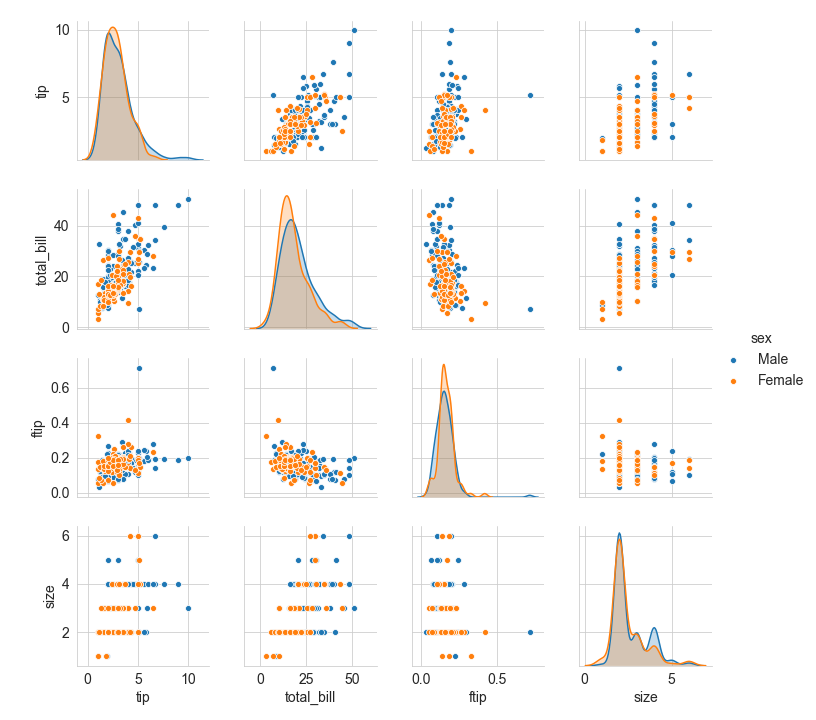
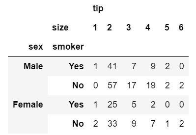
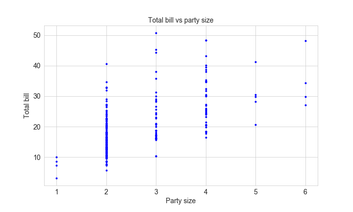
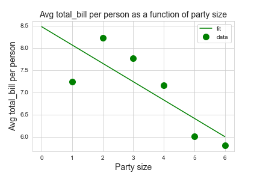

# The Tips Data Set 
## Elizabeth Daly

### HDip Data Analytics 2019 
### 52446 Fundamentals of Data Analysis Assessment

Git-hub repository at:
https://github.com/elizabethdaly/data-analysis-project.git

- Jupyter notebook: **tips-data-analysis.ipynb**
- data set: data\tips.csv

# Table of contents
1. [Introduction](#introduction)

2. [Description of the data set](#section2)
    1. [Initial steps](#sec2p1)
    2. [Descriptive statistics](#sec2p2)
    3. [Start looking at categories of diner](#sec2p3)
    4. [Plots to summarize some statistics](#sec2p4)

3. [Regression](#section3)
    1. [Regression in Seaborn](#sec3p1)
    2. [Simple linear regression using polyfit](#sec3p2)
    3. [Regression with Statsmodels](#sec3p3)
    4. [Regression with scikit-learn](#sec3p4)
    5. [Linear regression on various subsets of the data](#sec3p5)
    
4. [Relationships between variables](#section4)
    1. [Visualize relationships between numerical variables with pairplot](#sec4p1)
    2. [Investigate relationships between tip amount and the other variables](#sec4p2)
    3. [Does the amount spent depend on party size?](#sec4p3)
    4. [Classification](#sec4p4)
    
5. [Work done by other people on the Tips data set](#section5)
    
6. [Conclusion](#conclusion)

9. [References](#references)

## 1. Introduction 
- This README describes work done on the Tips data set for the Fundamentals of Data Analysis module assessment due 29 November 2019. Resources used include Python and associated packages Jupyter, matplotlib, Seaborn, scikit-learn, statsmodels, and SciPy. These packages all come as part of the Anaconda distribution of Python.
- The analysis takes the form of a single Jupyter notebook of filename given above. To view this file, download it from this repository and start Jupyter notebook in the folder containing the file. Use the command **Jupyter notebook** on the command line. 
- Alternatively, view a static version of the notebook (by providing its GitHub url) using Jupyter Nbviewer. 
- The Tips data set is included in the Seaborn visualization library. It can be loaded provided one has access to the internet when running the notebook. For the sake of completeness, I have downloaded the data set from the site referenced in the project instructions, and I include it in this repository as a csv file. It is located in the **data** subdirectory.
- All images intended for inclusion in this README are located in the **images** subdirectory of this repository.
- I have tried to structure the Jupyter notebook and this README so that they have corresponding sections. However, I do not wish to merely repeat here what has been stated in the notebook. I will endeavour to have this README summarize the work of the notebook and, hopefully, complement the analyses done there.

##  2. Description of the data set 
The data in the tips data set was gathered over a two and a half month period in early 1990. It contains 244 rows of data relating to tips left in a restaurant. I'm pretty certain that this is an American data set so I will assume that the currency is $. Information within includes the total bill, tip, number in the party, day of week, time of day, gender of the person paying the bill, and whether or not they are a smoker. The total bill and tip are non-negative real numbers with two decimal places; the standard way to represent currency. The size variable is an integer with values from 1 to 6. Tip, total bill, and size are numerical variables. The remaining variables are categorical with the following possible values: sex (Male, Female), smoker (Yes, No), day (Thursday, Friday, Saturday, Sunday) and time (Lunch, Dinner). 

I would say that the basic question is: does the tip amount depend on the total bill? One can also ask if the other variables influence the tip amount. Some of these questions will be addressed in sections 3 and 4.

### 2.1 Initial steps 
I often use sites such as Medium.com to see how other people have investigated data sets using Python. Two examples of such exploratory data analyses are given in the reference list. The very first step is always to check if the data needs cleaning by looking for duplicate rows, zero values or NaNs where they shouldn't be, etc. Our data set is small enough to inspect visually and it looks fine. Counting the number of valid entries in each column confirms this. The head of the data set looks like:

### 2.2 Descriptive statistics 
Pandas **describe()** can provide a quick summary of the data set as outlined in the notebook. However, without looking at the data in more detail, we cannot yet state what we think a typical diner is. What I mean is, just because most of the diners are male, smokers, and eating dinner on Saturday when we consider one variable at a time, that doesn't mean that all of these conditions are met simultaneously. In the notebook I calculate the tip as a fraction of the total bill as I think it's a measure of tip size that we are more familiar with. That is also done in the https://devarea.com/ reference below, in Wes McKinney's book when he is using the Tips data set as an example, and in the *Case Study 1: Restaurant Tipping* report, also below. So it seems like a sensible step to take. The output of pandas **describe(include="all")** is shown below. Here, all columns of the DataFrame are included in the analysis.

From this summary we can say that:
1. The average tip (as a fraction of total bill) is about 16%.
2. The 50th percentile is very similar to the mean, so the mean tip is a typical value in the data set.
3. More males than females paid the bill, 157 of the 244 observations.
4. More non-smokers than smokers paid the bill, 151 of the 244 observations.
5. Most of the observations relate to Saturday, 87 of the 244.
6. Most of the observations relate to dinner, 176 of the 244.
7. Party size varied from 1 to 6, with the average size being 2.5.

I used pandas **iloc** to identify the highest and lowest tip rates:
- The highest tip rate from a male smoker at dinner on Sunday in party size of 2, who left a 71% tip.
- The lowest tip rate was also left by a male smoker at dinner in a party size of 2, but on Saturday; 3.6%.

This is what a plot of tip versus total bill looks like. Here, data from each day is plotted in a different colour, but the same could also be done for any of the other categorical variables sex, smoker, and time.

### 2.3 Start looking at categories of diner 
We can use Pandas **groupby()** to get more detailed information about tipping behaviour for each category of diner. We are concerned with the fractional tip. From this part of the notebook, we can conclude that:
1. It seems that non-smokers, regardless of their sex, leave similar tips (about 16%).
2. On the other hand, for smokers, females leave higher tips than males on average (18% versus 15%).
3. The most frequently-occurring party size is 2 (156 of the total), followed by 3 (38), and 4 (37). There are only a handful of observations related to party sizes of 1, 5, and 6.
4. The data set only contains information about dinner on Saturday (87 out of 244) and Sunday (76). There is one dinner observation on Thursday, the rest are lunch (61). Friday has lunch and dinner recorded, but overall numbers are small (19 in total).
5. The highest average tip (as a fraction of total bill) is left at lunch on Fridays.
6. The lowest average tip (as a fraction of total bill) is left at dinner on Saturdays.

### 2.4 Plots to summarize some statistics 
The following plots summarize this information graphically. So far it looks like the best time to be waiter in this restaurant is at lunch on Fridays if one is interested in the highest fractional tip. The best type of diner to serve is a female smoker. At this point of the analysis, I am not yet sure how the day and time variables are related to sex and smoker ones.

##  3. Regression 
For this part of the assessment, we have been asked to analyse if there is a relationship between the total bill and the tip amount. The simplest relationship would be a linear one. That's reasonable when we consider that tips (especially in the US) are usually a fixed percentage of the total bill. A linear model looks like:

**y = m x + c**

where
- y is the tip
- x is the total bill
- m is the slope of the line
- c is the y intercept

### 3.1 Regression in Seaborn 
In the notebook we first use Seaborn to visualize any linear relationship between our two variables of interest using **regplot** and **lmplot**. This does not give us any fitting parameters such as the slope and intercept of the linear fit, or any metrics to assess the quality of the fit, but it's a good start. Here we plot the best straight lines through smoker and non-smoker data points, as found by Seaborn. We will look at these categories again later on in this section. For now we can say that the best straight lines through the data points have different slopes for smokers and non-smoker. The shaded regions represent the 95% confidence levels, and they don't even overlap in this plot. 

### 3.2 Simple linear regression using polyfit 
We perform a simple linear regression analysis of the data as per the week 9 lectures for this module. **numpy.polyfit** can calculate the slope and intercept of the best fit line based on least squares fitting. It doesn't directly return a metric, so we must use **numpy.corrcoef** to evaluate the strength of the linear relationship between the total bill and tip amount. This function returns a matrix from which we can calculate the R2 value as explained in the reference below about Pearson and Spearman Correlation in Python. The fitting parameters for our linear model are: 
- slope = 0.105
- intercept = 0.920
- R2 = 0.457

So, a linear relationship does exist between the total bill and the tip amount, but in my opinion, it's not a very strong one. When dealing with scientific data in the past, I would be looking for much higher R2 values. I'll discuss that more below. The best slope here corresponds to approximately a 10% tip, and note that the intercept is not zero; suggesting that the minimum tip is about $1. One can see lines of data points representing tip of $1, $2 and $3. This suggests that lots of diners round their tips to the nearest $. 

### 3.3 Regression with Statsmodels 
We then move on to using two packages, Statsmodels and scikit-learn, to perform linear regression and return fitting parameters and metrics. Statsmodels is a Python package for performing statistical analysis of data - we are interested in the OLS (Ordinary Least Squares) module for performing linear regression. OLS involves fitting a linear model with coefficients to minimize the residual sum of squares between the observed data points and the best fit: for each data point, square the difference between it and the best fit, and sum all of these residuals. We modify the model slightly to include a y intercept. The model returns a report containing statistical information, but for this project we are only interested in the slope, intercept, and value of R2.

### 3.4 Regression with scikit-learn 
Scikit-learn is a machine learning package which can also perform OLS fitting. Strictly speaking there is no need to perform regression with both packages, but I do it once in the notebook and then stick to scikit-learn.  This package is useful for making predictions using the data set, something we may get on to later. We use the scikit-learn LinearRegression model which performs OLS fitting.

In regression, R2 is the coefficient of determination, a measure of how close the data points are to the fitted regression line; or how much of the variation in the data is explained by the linear model. It ranges from 0 to 1, and in general, higher values of R2 are better. However, as the minitab reference below discusses, that's not the full story. That reference states that in fields which try to predict human behaviour (the tips data set falls into this category), values of R2 less that 0.5 are not unusual; we find R2 = 0.457 on average. It's also important to take into account the appropriateness of the model when assessing R2. Another model (perhaps a high-order polynomial fit) may produce a better value of R2 but wouldn't be a sensible way to model how tip amount varies with total bill. 

To conclude this part of the analysis: the tip does depend linearly on the total bill in this data set. The slope of the best fit line is 0.105, the y intercept is 0.920, and R2 is 0.457.

### 3.5 Linear regression on various subsets of the data 
The results of regression on all of the data, and on subsets of it, are presented in the table below.

Line fit    | R2 | slope | intercept
------------|---------------|-------|----------
All           | 0.457     | 0.105 | 0.920     |
size = 2      | 0.232     | 0.078 | 1.292     |
size = 2,3,4  | 0.438     | 0.105 | 0.920     |
F smokers     | 0.266     | 0.068 | 1.701     |
M smokers     | 0.232     | 0.073 | 1.425     |
F non-smokers | 0.686     | 0.128 | 0.452     |
M non-smokers | 0.670     | 0.140 | 0.348     |
day = Thur    | 0.660     | 0.128 | 0.512     |
day = Fri     | 0.597     | 0.095 | 1.109     |
day = Sat     | 0.495     | 0.121 | 0.519     |
day = Sun     | 0.251     | 0.070 | 1.753     |

What can we conclude from this? If higher R2 indicates better a fit, then the data is fitted well by a linear model for non-smokers (regardless of sex) and for day = Thursday; these subsets result in the largest R2 values and also high slopes. Maybe considering data from non-smokers on Thursday would produce the most reliable predictions of tip given total bill?

**Tip predictions:**

We can use our linear regression parameters to predict the tip amount for any total bill, say a bill of $100. 
- Using all of the data, we predict a tip of $11.42 for this total bill amount;
- For male non-smokers only, we predict a tip of $14.32;
- Considering data from Thursday alone, we predict a tip of $13.29;
- In contrast, Sunday data predicts just $8.77 as a tip.

As the average total bill in this restaurant is just less than $20 and the maximum is about $50, it's unlikely that anyone would ever spend $100 here in the first place!

## 4. Relationships between variables 
We have investigated if the tip amount is related to the total bill, and we have explored a little how that relationship is different depending on the subsets of data used. We now want to analyse other relationships between the variables of the data set.   

### 4.1 Visualize relationships between numerical variables with pairplot 
The Seaborn **pairplot** function plots pairwise relationships in a data set. It generates a grid of scatterplots of each numeric variable plotted against all the others, and a histogram of values when a variable is plotted against itself. The *hue* keyword can be used to differentiate between the different categorical variables on each subplot. Using pairplot on the tips data set suggests a possibility of a linear relationship between tip and total bill. Luckily, that is the relationship we were asked to investigate in the previous section. A variable could be used to separate categories if the histograms for different categories do not overlap too much. We don't see much evidence for that in the pairplot - unlike say in the iris data set - so I'll take it no further. Below is a Seaborn pairplot for this data set.

### 4.2 Investigate relationships between tip amount and the other variables 
I next used the **pivot_table()** function to summarize the tip according to each of the other variables. I came across this function in Wes McKinney's data analysis book and in his "10 minutes to Pandas" video (both referenced below). So, instead of looking at the average tip for the entire data set, we can see what the average tip is for all combinations of the sex and smoker categorical variables, for example. The default aggregation function is **mean** and I also use **count** to measure sample sizes. **max()** and **min()** are used to find the biggest and smallest values returned from pivot_table.

#### 4.2.1 Tip vs sex, smoker, and size

The output of pivot_table for average tip summarized against these three variables looks like:

Using the count function with pivot_table returns:

From this part of the notebook we can say that:
- The largest average tip is left by male non-smokers in a party of 6 (mean = $5.85 , count = 2).
- The lowest average tip is left by female smokers dining alone (mean = $1.00 , count = 1).
- The largest group is male non-smokers in a party of 2 (mean = $2.55, count = 57).

#### 4.2.2 Tip vs sex, smoker, and day

We then used a pivot_table to calculate averages of tip over sex, smoker and day variables. I won't include the table itself here, just the main results we are interested in, namely:
- The largest average tip is left by male smokers on Sundays (mean = $3.52 , count = 15).
- The lowest average tip is left by female non-smokers on Thursdays (mean =$2.46, count = 25).
- The largest group is male non-smokers on Sundays (mean = $3.12, count = 43).

#### 4.2.3 Tip vs sex, smoker, day, time and size

Rather than continuing on trying to find meaningful combinations of variables to use, I finally realised that I could make a pivot table summarizing tip averages over five other variables. The table is huge and not easy to read, but the main findings are:
- The highest average tip comes from male non-smokers at lunch on Thursday in a party of six (mean = $6.70 , count = 1).
- The lowest average tip is left by female smokers (and non-smokers) dining alone at dinner on Saturdays (mean = $1.00 , count = 1 each).
- The largest group is male, non-smokers, dining with one other person at dinner on Sundays (mean = $2.59, count = 22). The average tip left by this group is very similar to the average tip for the whole data set, $2.99.

### 4.3 Does the amount spent depend on party size? 
We will now look for any relationships between the tip or total bill amounts and the dining party size. Below is a plot of the total bill versus party size, with data clumped along the y axis at each party size integer value. We first calculate the correlation matrix and resulting R2 for total bill and party size;  R2 = 0.358 so there is a weak linear relationship there. The total bill does increase as party size increases, as you would expect. 

The tip also increases as party size increases but I did not perform any regression on that data. Instead I decided to look at the total bill or tip *per person*. For this, two new columns are added to the data set:
- tpp or tip per person = tip / size
- bpp or bill per person = total bill / size

Pandas **groupby()** is then used to calculate the average tip or bill per person for each party size. Be aware that we don't have a lot of data for party sizes of 1, 5, or 6. Simple linear regression (using numpy.polyfit) was then performed on these average values. I wanted to see if the average bill (or tip) per person was linearly related to party size. The resulting plots and fit parameters are:

Slope = -0.412130, intercept = 8.475404, R2 = 0.653

Slope = -0.125348, intercept = 1.533718, R2 = 0.933

Summary of findings:
- The average bill per person decreases as party size increases.
- There is a good linear relationship (high R2) between the average bill per person and party size.
- The average tip per person also decreases as party size increases.
- There is a very strong linear relationship (high R2) between the average tip per person and party size.
- In conclusion, larger parties spend more money in total, but each person in the party spends less than if they were part of a smaller group.
- Alternatively, the reduction in bill and tip per person could be happening because these larger parties include children, and children's meals are usually less expensive than adult meals.

### 4.4 Classification 
The last thing we will do is see if we can use any of the numerical variables to predict some of the categorical ones. This is called classification, as we are attempting to predict the value of a discrete categorical variable like sex, smoker, day or time for this particular data set. The categorical variables correspond to classes; we wish to predict, for example, the value of the time class - is it lunch or dinner? For this part of the notebook we use scikit-learn, a machine learning package for Python. 

### K-nearest neighbours (knn) classification
The algorithm we use is called k-nearest neighbours (knn). As the scikit-learn documentation states, "Classification is computed from a simple majority vote of the nearest neighbors of each point: a query point is assigned the data class which has the most representatives within the nearest neighbors of the point." It is an example of supervised learning because we train the classifier with data where the outputs that correspond to certain inputs are already known. The training data is a random  selection of observations from the data set. The testing data consists of the remaining observations. Performance of the classifier is quantified by measuring how many of the outputs in the testing data it predicts correctly. In the notebook we use the numerical variables tip, total bill, and size to make predictions of time - lunch or dinner. The classification is performed using the full data set and also again for a subset of the data set that includes only non-smokers.
- The knn classifier for 5 nearest neighbours has a 69% success rate at predicting time over 100 runs. It's much better than just guessing.
- Considering only non-smokers reduces the performance slightly, to 65%.
- The actual numbers change a little each time the notebook is run, but the full data set has always performed better than the subset.

## 5. Work done by other people on the Tips data set 
The tips data set is often used to illustrate the capabilities of Seaborn, so it appears a lot in the documentation for that package. These and some other examples are listed in the references below. It was actually difficult to find something new to do with this data set, but I haven't come across an analysis like I did in section 4.3, where I looked at tip and total bill per person. 

I found an anonymous report from Iowa State University on the tips data state which is referenced below. It seems to be a report for a statistics class but with a business bias. There is no code in the report. Indeed, I don't know what application was used to perform the analysis, but I'm guessing a pure statistics package as there is mention of t-values and p-values without explanation of what they are. In that analysis, the tip rate (or fractional tip) is fitted against sex, smoker, time, size and day (but not Sunday for some reason). They conclude that size is the most important predictor of tip rate, followed by Saturday data. They then fit tip rate against size alone; and conclude that the tip rate drops by about 1% for each additional diner. 

## 6. Conclusion 
The main findings of this analysis are:
1. Average tip = $2.99, minimum = $1, maximum = $10.
2. Average total bill = $19.79, minimum = $3.07, maximum = $50.81.
3. Average fractional tip = 0.16, minimum = 0.04, maximum = 0.71.
4. 151 of the 244 observations concern non-smokers.
5. 157 of the 244 observations concern males.
6. 87 of the 244 observations relate to Saturday.
7. 176 of the 244 observations relate to dinner.
8. 156 of the 244 observations concern party size of two.
9. The largest group represented in the data set is: male, non-smokers, dining with one other person at dinner on Sundays. There are 22 of them. The average tip left by this group is $2.59, very similar to the average tip for the whole data set, $2.99. 
10. There is a linear relationship between tip and total bill: tip = 0.11 (total_bill) + 0.92
11. Larger parties spend more money in total, but each person in the party spends less than if they were part of a smaller group. The same applies to the tip amount. The tip per person versus size is fit really well by a linear model. 
12. A k-nearest neighbours classifier was used to predict time from tip, total bill and size inputs. The classifier predicted the time (lunch or dinner) correctly about 69% of the time. Considering only data from non-smokers reduced the classifier performance by a few percent.

## 7. References 

**General:**

- [1]  Anaconda Distribution
https://www.anaconda.com/

- [2] Python Software Foundation
https://www.python.org/

- [3] Project Jupyter
https://jupyter.org/

- [4] Sharing Jupyter notebooks
https://nbviewer.jupyter.org/

- [5] seaborn: statistical data visualization
https://seaborn.pydata.org/index.html#

- [6] matplotlib: Python plotting library
https://matplotlib.org/

- [7] The Tips data set from Michael Waskom
https://github.com/mwaskom/seaborn-data/blob/master/tips.csv

- [8] Description of what is contained in the tips set
https://www.kaggle.com/ranjeetjain3/seaborn-tips-data set

- [9] scikit-learn: Machine Learning in Python
https://scikit-learn.org/stable/index.html

- [10] StatsModels: Statistics in Python
https://www.statsmodels.org/stable/index.html

- [11] scipy.stats : Statistics with SciPy
https://docs.scipy.org/doc/scipy/reference/tutorial/stats.html

**Exploratory data analysis:**

- [12] Exploratory Statistical Data Analysis with a Real data set using Pandas
https://towardsdatascience.com/exploratory-statistical-data-analysis-with-a-real-data set-using-pandas-208007798b92

- [13] How to investigate a data set with Python
https://towardsdatascience.com/hitchhikers-guide-to-exploratory-data-analysis-6e8d896d3f7e

- [14] Data analysis with Python
https://medium.com/@onpillow/01-investigate-tmdb-movie-data set-python-data-analysis-project-part-1-data-wrangling-3d2b55ea7714

- [15] Python for Data Analysis: Data Wrangling with Pandas, NumPy, and IPython. 
Wes McKinney. ISBN-13: 978-1491957660 ISBN-10: 1491957662

- [16] Pandas In 10 Minutes || Wes McKinney
https://www.youtube.com/watch?v=1MGCD8SQp3k

- [17] Good description of quartiles on Seaborn plots
https://towardsdatascience.com/analyze-the-data-through-data-visualization-using-seaborn-255e1cd3948e

**Regression:**

- [18] Ordinary Least Squares in statsmodels
https://www.statsmodels.org/dev/examples/notebooks/generated/ols.html

- [19] Generalized Linear Models in scikit-learn
https://scikit-learn.org/stable/modules/linear_model.html#ordinary-least-squares

- [20] How to run Linear regression in Python scikit-Learn
https://bigdata-madesimple.com/how-to-run-linear-regression-in-python-scikit-learn/

- [21] A beginner’s guide to Linear Regression in Python with Scikit-Learn
https://towardsdatascience.com/a-beginners-guide-to-linear-regression-in-python-with-scikit-learn-83a8f7ae2b4f

- [22] Regression Analysis: How Do I Interpret R-squared and Assess the Goodness-of-Fit?
https://blog.minitab.com/blog/adventures-in-statistics-2/regression-analysis-how-do-i-interpret-r-squared-and-assess-the-goodness-of-fit

- [23] Python and R Tips To Learn Data Science: Pearson and Spearman Correlation in Python
https://cmdlinetips.com/2019/08/how-to-compute-pearson-and-spearman-correlation-in-python/

**Classification:**

- [24] K-nearest Neighbors (KNN) Classification Model
https://www.ritchieng.com/machine-learning-k-nearest-neighbors-knn/

- [25] Supervised and Unsupervised Machine Learning Algorithms
https://machinelearningmastery.com/supervised-and-unsupervised-machine-learning-algorithms/

- [26] Cross-Validation
https://www.ritchieng.com/machine-learning-cross-validation/

**References directly relating to Tips:**

- [27] Tips data set in PYTHON MACHINE LEARNING EXAMPLE – LINEAR REGRESSION
https://devarea.com/python-machine-learning-example-linear-regression/#.XbbfgOj7Q2w

- [28] Tips analysis using Seaborn: Visualizing statistical relationships
https://seaborn.pydata.org/tutorial/relational.html#relational-tutorial

- [29] Tips analysis using Seaborn: Plotting with categorical data
https://seaborn.pydata.org/tutorial/categorical.html#categorical-tutorial

- [30] Tips analysis using Seaborn: Visualizing linear relationships
https://seaborn.pydata.org/tutorial/regression.html#regression-tutorial

- [31] Tips analysis using Seaborn: Building structured multi-plot grids
https://seaborn.pydata.org/tutorial/axis_grids.html#grid-tutorial

- [32] STAT 503 Case Study 1: Restaurant Tipping (Author unknown)
https://dicook.public.iastate.edu/stat503/05/cs-tips2.pdf

- [33] Interactive analytics and predictions on Restaurant tips
https://medium.com/@valentinaalto/interactive-analytics-and-predictions-on-restaurant-tips-94f21f537de8

- [34] Seaborn again: Python Data Visualisation using Seaborn 
https://grindsquare.co.za/python-data-visualisation-using-seaborn/

- [35] Excerpt from the Python Data Science Handbook by Jake VanderPlas; Jupyter notebooks are available on GitHub.
https://jakevdp.github.io/PythonDataScienceHandbook/04.14-visualization-with-seaborn.html

- [36] Interactive analytics and predictions on Restaurant tips
https://datasciencechalktalk.com/2019/11/03/interactive-analytics-and-predictions-on-restaurant-tips/